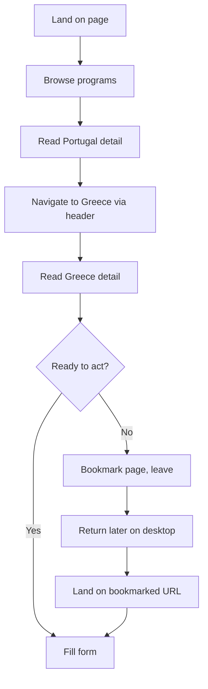
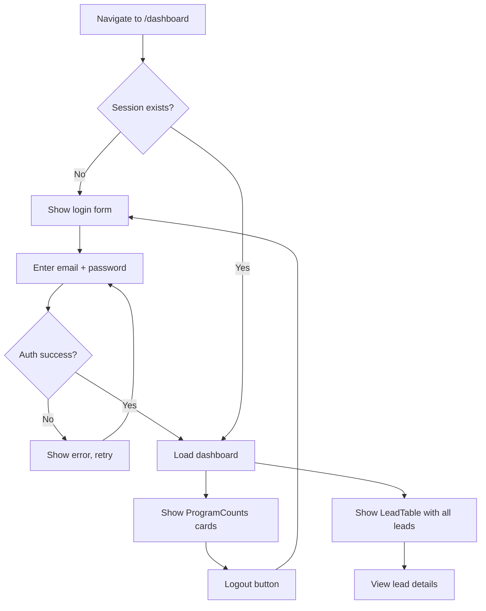

# UX Design Specification - Points Guy Landing Page

**Author:** Wassim
**Date:** 2026-01-28

---

## Executive Summary

### Project Vision

A content-driven showcase site converting organic social media traffic from The Points Guy (influencer partner with millions of followers) into qualified leads for Mercan's investment immigration programs (Portugal, Greece, Panama). Unlike Mercan's existing conversion-optimized funnels built for paid advertising, this site uses an informational, lifestyle-first tone that preserves audience trust. It serves as a link-in-bio destination catching warm traffic from Instagram and TikTok.

### Target Users

**Primary — "Omar" (Affluent Global Traveler):**
- 30-55 years old, high-net-worth, frequent international traveler
- Arrives on mobile from social media (Instagram/TikTok link-in-bio)
- Varies from Golden Visa novice to informed prospect
- Wants to browse programs without pressure, express interest when ready
- Success: "I understand what Mercan offers, I see which program fits me, and I've submitted my interest without feeling pressured"

**Secondary — The Points Guy (Influencer Partner):**
- Checks a simple dashboard for lead counts and program breakdown
- Needs a quick glance at activity, not deep analytics
- Screenshots stats for weekly calls with Mercan

### Key Design Challenges

1. **Trust-preserving tone on mobile** — Primary traffic is from Instagram/TikTok link-in-bio taps. The transition from social media content to the web page must feel seamless, not jarring. No popups, no urgency, no hard sell. The design itself must communicate "informational" not "funnel."

2. **2-step form friction balance** — The form captures 8+ fields across two steps. Step 1 is low-friction (name, email, program), but Step 2 asks for phone, nationality, residence. The transition between steps must feel natural and worth continuing — not like a bait-and-switch.

3. **Three programs, one landing page** — The landing page must present Portugal, Greece, and Panama distinctly enough that visitors quickly identify which interests them, without overwhelming with a wall of content on first load.

### Design Opportunities

1. **Magazine-editorial feel** — The product brief calls for content that feels like "reading a magazine feature, not being pitched." This enables lifestyle-first imagery, generous whitespace, and editorial typography that differentiates from typical marketing funnels.

2. **Program-to-form continuity** — When a user taps a program card and lands on the detail page, the form auto-fills the program. This creates a natural flow from browsing to expressing interest — the CTA can be a soft scroll prompt rather than an aggressive button.

3. **Mobile-native feel** — Since most traffic comes from social media apps, the site can use touch-optimized interactions, full-bleed images, and fluid transitions (Framer Motion) that feel native to the mobile context users are coming from.

## Core User Experience

### Defining Experience

**Core user action:** Browse programs and express interest. The ONE interaction to get right is the journey from landing on the page → understanding a program → submitting the form. This is a single-session, single-visit flow — most users won't come back. The first impression IS the entire experience.

**What must be effortless:** Scrolling through program content on mobile and transitioning from "browsing" to "I'm interested" without a mental gear-shift. The form should feel like a natural continuation of reading, not a separate action.

### Platform Strategy

- **Primary platform:** Mobile web (Instagram/TikTok link-in-bio traffic)
- **Secondary:** Desktop web (return visits, bookmarked URLs)
- **Interaction model:** Touch-first. Vertical scrolling, tap navigation, no hover-dependent interactions
- **No offline needed** — content is always-online, static pages cache well
- **No app-specific capabilities** — standard mobile web, optimized for speed
- **Breakpoints:** Mobile (default), Tablet (768px), Desktop (1024px+)

### Effortless Interactions

1. **Program discovery** — Landing on the page and understanding all 3 programs within the first scroll. No clicking required to get the gist. Cards should communicate country + investment type + key benefit at a glance.

2. **Program-to-form flow** — Tapping a program card, reading the detail page, and reaching the form should feel like one continuous scroll experience. The form appears naturally at the bottom — no modal, no separate page, no popup.

3. **Form step transition** — Moving from Step 1 (name, email, program) to Step 2 (phone, nationality, etc.) should feel like revealing more of the same form, not jumping to a new context. Smooth animation, clear progress indication.

4. **Auto-fill intelligence** — When arriving from a program detail page, the program field is already selected. When on the main page, the program selector is prominent. No redundant choices.

### Critical Success Moments

1. **First 3 seconds** — User lands from Instagram/TikTok. Page loads instantly, looks premium, feels trustworthy. If it looks like a cheap funnel page, they bounce immediately.

2. **Program card scan** — User scrolls past hero, sees 3 program cards. Within 5 seconds they should identify which country/program interests them and feel compelled to tap.

3. **Form Step 1 completion** — User enters name and email. This is the commitment moment. If Step 1 feels quick and low-stakes, they'll continue to Step 2. If it feels heavy, they abandon.

4. **Confirmation** — After submitting, the user needs immediate reassurance: their data was received, someone will contact them, and they didn't just throw info into a void.

### Experience Principles

1. **Content first, conversion second** — Every design decision prioritizes the reading experience. The form is a natural endpoint of content consumption, never an interruption.

2. **Premium without pretension** — The design communicates quality and trust (real estate aesthetic, generous whitespace, lifestyle imagery) without feeling exclusive or intimidating.

3. **Mobile-native fluidity** — Interactions feel like scrolling through a well-designed social media experience. Transitions are smooth, touch targets are generous, content flows vertically.

4. **Minimal cognitive load** — Users should never wonder "what do I do next?" Navigation is obvious, program differentiation is clear, form fields are self-explanatory. No decision fatigue.

5. **Soft persuasion** — CTAs guide rather than push. "Want to learn more?" not "ACT NOW!" Trust the content to create interest, then make expressing that interest effortless.

## Desired Emotional Response

### Primary Emotional Goals

**Trust & Credibility** — The dominant emotion. Users arrive already trusting The Points Guy. The site must reinforce that trust, not break it. Every element should signal: "This is legitimate, professional, and worth your attention."

**Curiosity & Aspiration** — Users should feel drawn into the lifestyle these programs represent. Not "I need to buy this" but "I want to learn more about this life." The content creates a pull, not a push.

**Calm Confidence** — The opposite of urgency-driven anxiety. Users should feel in control of their journey, confident they can explore at their own pace, and assured that expressing interest is safe and low-commitment.

### Emotional Journey Mapping

| Stage | Desired Emotion | Design Implication |
|-------|----------------|-------------------|
| **Landing (0-3s)** | "This looks legit and premium" | Fast load, clean layout, quality imagery, no clutter |
| **Browsing programs** | "This lifestyle is aspirational but attainable" | Lifestyle photography, benefit-focused copy, editorial spacing |
| **Reading detail page** | "I understand this clearly, it's well-structured" | Scannable sections, clear information hierarchy, no jargon walls |
| **Reaching the form** | "This feels natural, I want to learn more" | Soft CTA language, form integrated into page flow, not isolated |
| **Filling Step 1** | "This is quick and easy" | Only 3 fields, clear labels, instant validation feedback |
| **Transitioning to Step 2** | "Fair enough, this makes sense" | Smooth animation, progress indicator, explanation of why |
| **Filling Step 2** | "I'm investing a minute for a real opportunity" | Smart dropdowns, optional fields clearly marked |
| **Confirmation** | "Done. Someone real will reach out." | Warm confirmation message, clear next steps, no upsell |
| **Error state** | "No problem, I can fix this" | Inline field errors, friendly tone, no red walls of shame |

### Micro-Emotions

**Prioritize:**
- **Confidence** over confusion — Every element has clear purpose, no ambiguity
- **Trust** over skepticism — Premium design, real imagery, no stock photo feel
- **Accomplishment** over frustration — Form completion feels like progress, not a chore

**Avoid:**
- **Pressure** — No countdown timers, no "limited spots," no urgency language
- **Suspicion** — No excessive data requests without context, no hidden terms
- **Overwhelm** — No wall-of-text program descriptions, no 15-field forms on one screen
- **Abandonment anxiety** — No exit-intent popups, no "wait, don't leave!" modals

### Emotional Design Principles

1. **Earned attention** — The design earns continued scrolling through quality content and visuals, never demands it through manipulation
2. **Transparent intent** — The form clearly states what happens after submission. No surprises, no hidden commitments
3. **Graceful degradation** — Errors are friendly, loading states are calm, empty states are helpful. Nothing feels broken or hostile
4. **Aspirational accessibility** — Lifestyle imagery is aspirational but inclusive. Premium without being elitist

## UX Pattern Analysis & Inspiration

### Inspiring Products Analysis

**Luxury Real Estate Portals (Sotheby's, Knight Frank):**
- Full-bleed property imagery with minimal overlaid text
- Editorial content layout — long-form content that reads like a feature article, not a brochure
- Muted, sophisticated color palettes (navy, charcoal, ivory, gold accents)
- Inquiry forms positioned as natural endpoints of property exploration, not aggressive popups
- Program/property cards with strong photography, clear location/price anchors, and soft CTAs

**High-End Travel/Lifestyle Sites (Aman, Four Seasons):**
- Hero sections that are almost entirely image — text is minimal and typographically refined
- Vertical scroll storytelling — each scroll reveals a new aspect of the experience
- Extremely generous whitespace — content breathes, nothing feels crowded
- Subtle animations on scroll (parallax, fade-in reveals) that feel premium not gimmicky
- CTAs are almost invisible — "Explore" or "Discover" rather than "Book Now"
- Mobile experience feels native — full-width images, thumb-friendly navigation

### Transferable UX Patterns

**Navigation:**
- **Sticky minimal header** — Logo + hamburger on mobile, expands to program links on desktop. Transparent over hero, solid on scroll.
- **Program card grid** — 3 cards side-by-side on desktop, vertical stack on mobile. Each card: hero image + country name + one-line benefit + "Explore" link.

**Content & Layout:**
- **Editorial scroll storytelling** — Program detail pages use alternating image/text sections that reveal as you scroll. Creates rhythm without monotony.
- **Full-bleed hero with overlay text** — Lifestyle image fills viewport, headline and subtext overlaid in light text with subtle gradient backdrop. Scroll indicator at bottom.

**Form & Conversion:**
- **Embedded inquiry form** — Form lives within the page flow, styled consistently with content. Not a modal, not a separate page.
- **Progressive disclosure** — Step 1 shows minimal fields, Step 2 slides in smoothly. Progress bar or step indicator keeps users oriented.

**Micro-interactions:**
- **Scroll-triggered fade-ins** — Content sections fade in as they enter viewport. Subtle, 200-300ms, opacity + slight upward translate.
- **Card hover lift** — Program cards lift slightly on hover (desktop) with shadow increase. On mobile, tap feedback via subtle scale.

### Anti-Patterns to Avoid

- **Aggressive floating CTAs** — No sticky "Contact Us" buttons covering content on mobile
- **Auto-playing video backgrounds** — Heavy on mobile data, breaks LCP < 2s requirement
- **Carousel/slider hero sections** — One strong hero image beats 5 rotating ones
- **Dense information tables** — Investment details as magazine-style content, not spreadsheets
- **Chat widgets / live chat popups** — Breaks the "no interruption" principle
- **Social proof urgency** — No "47 people viewed this today" or "Only 3 spots left"

### Design Inspiration Strategy

**Adopt:**
- Full-bleed lifestyle hero imagery with minimal overlay text
- Editorial alternating-section layout for program detail pages
- Embedded inquiry form as a natural page section
- Generous whitespace and typographic hierarchy
- Scroll-triggered subtle fade-in animations (Framer Motion)

**Adapt:**
- Property card grid → simplified to 3 program cards with country imagery + key benefit
- Real estate inquiry form → 2-step progressive disclosure with smooth transitions
- Minimal navigation → add program quick-links since we have only 3 destinations

**Avoid:**
- Any element that signals "marketing funnel" — popups, sticky CTAs, urgency, countdown timers
- Heavy media that hurts mobile performance — video backgrounds, large unoptimized images
- Complex navigation patterns — 4 public pages + 1 dashboard, keep it simple

## Design System Foundation

### Design System Choice

**Approach: Custom Tailwind-based design system**

Custom UI components built on Tailwind CSS 4 utility classes, with `clsx` + `tailwind-merge` for conditional styling. No external component library. Components hand-built in `components/ui/` — Button, Card, Input, Select, Textarea.

### Rationale for Selection

1. **Small component surface** — Only ~5 UI primitives needed. A full component library would be overkill.
2. **Premium visual uniqueness** — Luxury real estate aesthetic requires full control over spacing, typography, and color.
3. **Tailwind CSS 4 already chosen** — Adding a component library creates styling conflicts and bundle bloat.
4. **Proven pattern** — Existing Mercan projects use the same approach: custom components on Tailwind.
5. **Performance** — No component library overhead. Tailwind purges unused styles. Page weight stays under 1MB NFR target.

### Implementation Approach — Design Tokens

**Colors:**
- Navy (primary): deep navy for headings, header, footer
- Gold (accent): gold for CTAs, highlights, active states
- White/Ivory (background): clean backgrounds, card surfaces
- Slate (text): body text, secondary content
- Success/Error: green/red for form validation states

**Typography:**
- Font: Inter (Google Fonts or self-hosted)
- Scale: text-sm (14px), text-base (16px), text-lg (18px), text-xl (20px), text-2xl (24px), text-3xl (30px), text-4xl (36px)
- Weights: 400 (body), 500 (emphasis), 600 (subheadings), 700 (headings)

**Spacing:**
- Section padding: py-16 mobile, py-24 desktop
- Content max-width: max-w-7xl (1280px)
- Card gaps: gap-6 mobile, gap-8 desktop
- Form field spacing: space-y-4

**Radius:**
- Cards: rounded-xl (12px)
- Buttons: rounded-lg (8px)
- Inputs: rounded-md (6px)

**Shadows:**
- Cards: shadow-sm default, shadow-md on hover
- Form container: shadow-lg

### Customization Strategy

**Component Variants:**
- `Button`: primary (gold bg, dark text), secondary (navy outline), ghost (text only)
- `Card`: default (white bg, shadow), elevated (larger shadow), transparent (no bg)
- `Input/Select/Textarea`: default, focus (gold ring), error (red ring + message), disabled

**Responsive Strategy:**
- All components mobile-first
- Touch targets minimum 44x44px on mobile
- Form fields full-width on mobile, constrained on desktop
- Cards stack vertically on mobile, grid on desktop

**Animation Tokens (Framer Motion):**
- Fade-in: `opacity: 0 → 1`, `y: 20 → 0`, duration `0.5s`, ease `easeOut`
- Card hover: `y: 0 → -4`, `shadow: sm → md`, duration `0.2s`
- Form step transition: `x: 20 → 0`, `opacity: 0 → 1`, duration `0.3s`
- Page entrance: staggered children, `0.1s` delay between items

## Defining Core Experience

### The Defining Interaction

**"Scroll to discover, tap to explore, submit to connect."**

The entire value proposition is delivered through passive content consumption (scrolling) that naturally leads to an active micro-commitment (the form). No account creation, no complex workflow, no learning curve.

### User Mental Model

**What users expect:** A well-designed informational page — similar to scrolling a premium magazine article on their phone. Coming from Instagram/TikTok, their mental model is: "I'll scroll through this, see what it's about, and decide if I care enough to act."

**What they don't expect:** A web app. They're not logging in, creating profiles, or navigating complex menus. The experience should feel closer to reading a single long-form article than using a product.

**Current comparisons:** Other link-in-bio destinations — Linktree pages, brand landing pages, influencer collaboration sites. The bar is "loads fast, looks good, makes sense quickly."

**Where confusion happens:** Investment immigration is complex. Users might not know what a Golden Visa is, what "fund investment" means, or how residency-by-investment works. Content must educate without overwhelming.

### Experience Mechanics

**1. Initiation — Landing:**
- User taps link-in-bio from Instagram/TikTok
- Hero loads instantly: full-bleed lifestyle image, headline, subtle scroll indicator
- No interstitial, no cookie wall, no popup — straight to content

**2. Discovery — Program Cards:**
- User scrolls past hero, 3 program cards fade in
- Each card: country image + country name + one-line benefit + "Explore" link
- Cards are tappable — entire card is the touch target
- Desktop: 3 columns. Mobile: vertical stack with generous spacing

**3. Exploration — Detail Page:**
- User taps a program card → detail page loads
- Alternating image/text sections reveal program benefits as they scroll
- Content is scannable: bold benefit headlines, short paragraphs, lifestyle imagery between sections
- Form appears naturally at the bottom

**4. Expression — Lead Form:**
- Soft CTA text: "Want to learn more? Let's talk."
- Step 1: name, email, program (auto-filled from current page)
- User fills 2-3 fields, taps "Continue"
- Step 2 slides in: phone, nationality, residence, timeline (optional), questions (optional), newsletter checkbox
- User taps "Get My Free Consultation"
- Form validates inline — errors appear under specific fields, not as a block

**5. Confirmation — Success:**
- Form fades to confirmation message
- "Thank you, [Name]. We'll be in touch within 24 hours."
- Optionally shows links to explore other programs
- No redirect, no new page — stays in context

## Visual Design Foundation

### Color System

**Primary Palette:**

| Token | Color | Hex | Usage |
|-------|-------|-----|-------|
| `navy-900` | Deep Navy | `#0A1628` | Header bg, footer bg, primary headings |
| `navy-800` | Dark Navy | `#132240` | Section backgrounds (alternating dark) |
| `navy-700` | Navy | `#1B3A5C` | Secondary text on light bg, borders |
| `gold-500` | Gold | `#C9A84C` | Primary CTA buttons, accent highlights, active states |
| `gold-400` | Light Gold | `#D4B85E` | Hover state for gold elements |
| `gold-600` | Dark Gold | `#B8953E` | Active/pressed state for gold CTAs |

**Neutral Palette:**

| Token | Color | Hex | Usage |
|-------|-------|-----|-------|
| `white` | White | `#FFFFFF` | Card backgrounds, primary page bg |
| `ivory-50` | Ivory | `#FAFAF5` | Alternating section bg (warm white) |
| `slate-100` | Light Gray | `#F1F5F9` | Input field backgrounds, dividers |
| `slate-400` | Mid Gray | `#94A3B8` | Placeholder text, disabled states |
| `slate-600` | Dark Gray | `#475569` | Body text |
| `slate-800` | Near Black | `#1E293B` | Primary body text on light bg |

**Semantic Colors:**

| Token | Color | Hex | Usage |
|-------|-------|-----|-------|
| `success-500` | Green | `#22C55E` | Form success, validation pass |
| `error-500` | Red | `#EF4444` | Form errors, validation fail |
| `error-50` | Light Red | `#FEF2F2` | Error field background tint |
| `focus-ring` | Gold | `#C9A84C` | Focus ring on interactive elements |

**Dark Section Pattern:**
- Navy-800 background sections with white/ivory text for contrast
- Used for hero overlays, testimonial sections, and form container backgrounds
- Creates visual rhythm when alternating with white/ivory sections

### Typography System

**Font Family:** Inter (Google Fonts) — clean, modern, excellent readability at all sizes

| Level | Size | Weight | Line Height | Usage |
|-------|------|--------|-------------|-------|
| Hero headline | text-4xl / md:text-5xl | 700 | 1.1 | Main hero text |
| Page title | text-3xl / md:text-4xl | 700 | 1.2 | Program page titles |
| Section heading | text-2xl / md:text-3xl | 600 | 1.3 | Section headers |
| Card title | text-xl | 600 | 1.4 | Program card names |
| Subheading | text-lg | 500 | 1.5 | Benefit headlines, form section titles |
| Body | text-base (16px) | 400 | 1.6 | Primary content, descriptions |
| Small | text-sm (14px) | 400 | 1.5 | Form labels, captions, metadata |
| Caption | text-xs (12px) | 400 | 1.4 | Timestamps, helper text, legal |

**Typography Rules:**
- Headings: navy-900 on light bg, white on dark bg
- Body: slate-800 on light bg, slate-100 on dark bg
- Maximum content width for body text: `max-w-prose` (65ch) for readability
- Letter spacing: `-0.02em` on headings for tighter premium feel

### Spacing & Layout Foundation

**Layout Grid:**
- Content max-width: `max-w-7xl` (1280px), centered with `mx-auto`
- Horizontal padding: `px-4` mobile, `px-6` tablet, `px-8` desktop
- 12-column grid on desktop, single column mobile

**Section Spacing:**
- Between major sections: `py-16` mobile (64px), `py-24` desktop (96px)
- Between subsections: `py-8` mobile (32px), `py-12` desktop (48px)
- Hero section: full viewport height on mobile (`min-h-screen`), `min-h-[80vh]` on desktop

**Component Spacing:**
- Card grid gap: `gap-6` mobile (24px), `gap-8` desktop (32px)
- Form fields: `space-y-4` (16px) between fields
- Form steps: `space-y-6` (24px) between step groups
- Button padding: `px-6 py-3` standard, `px-8 py-4` hero CTA
- Input padding: `px-4 py-3`

**Visual Rhythm:**
- Alternating section backgrounds: white → ivory → navy (dark) → white → ivory
- Each program detail page follows: hero (dark) → benefits (white) → details (ivory) → lifestyle (dark) → form (white)

### Accessibility Considerations

**Color Contrast (WCAG 2.1 AA):**
- Navy-900 on white: ~15:1 ratio (exceeds AA)
- Slate-800 on white: ~9:1 ratio (exceeds AA)
- White on navy-800: ~12:1 ratio (exceeds AA)
- Gold-500 on navy-900: ~5.5:1 ratio (passes AA for large text)
- Gold-500 on white: ~3.2:1 ratio (use only for large buttons/accents, never for body text)

**Focus States:**
- All interactive elements: `ring-2 ring-gold-500 ring-offset-2` on focus
- Visible focus indicators meet WCAG 2.4.7
- Tab order follows visual layout

**Touch Targets:**
- Minimum 44x44px for all interactive elements on mobile
- Buttons: minimum height `h-12` (48px)
- Form inputs: minimum height `h-12` (48px)
- Card touch targets: entire card surface is tappable

**Motion:**
- `prefers-reduced-motion` media query respected — disable Framer Motion animations
- No essential information conveyed through animation alone
- All transitions under 500ms

## Design Direction

### Chosen Direction: Editorial Luxury

**Direction:** Hybrid of luxury real estate portals (Sotheby's/Knight Frank) and high-end travel sites (Aman/Four Seasons). Editorial feel with premium imagery, generous whitespace, and soft conversion elements.

### Visual Treatment

**Hero Sections:**
- Full-bleed lifestyle photography filling the viewport
- Headline overlaid in white Inter 700, positioned bottom-left on mobile, center on desktop
- Subtle dark gradient overlay (bottom 40%) for text readability
- Animated scroll indicator (chevron or line) at bottom center

**Program Cards (Landing Page):**
- 3 cards in a grid (desktop) or vertical stack (mobile)
- Each card: 16:9 aspect ratio lifestyle image, country name overlay at bottom
- One-line benefit text below image: "European residency through luxury hospitality investment"
- Entire card is a link — hover lifts card with shadow increase, mobile has tap scale feedback
- Rounded-xl corners, shadow-sm default

**Program Detail Pages:**
- Alternating sections: image-left/text-right, then image-right/text-left
- Full-width lifestyle image sections breaking up content blocks
- Benefit sections: icon + headline + 2-3 line description
- Investment details presented as clean, spaced-out key-value pairs — not tables
- Each section fades in on scroll entry (Framer Motion)

**Form Section:**
- Navy-800 background section with white card containing the form
- Section headline: "Want to learn more? Let's talk." in white text above form card
- Trust line below CTA: "We respond within 24 hours. Your data is secure." in slate-400
- Form card: white bg, rounded-xl, shadow-lg, max-w-lg centered

**Dashboard:**
- Clean white background, minimal chrome
- Summary cards at top: Total Leads, Portugal, Greece, Panama — each with count and navy/gold accent
- Lead table below: sortable columns (name, email, program, date), alternating row backgrounds
- Login form: centered card, navy-800 background page, simple email/password

## User Journey Flows

### Journey 1: Social Media → Program Discovery → Lead Submission

```mermaid
flowchart TD
    A[Instagram/TikTok Post] --> B[Tap Link-in-Bio]
    B --> C[Landing Page Hero Loads]
    C --> D[Scroll Past Hero]
    D --> E[See 3 Program Cards]
    E --> F{Which program?}
    F -->|Portugal| G1[/portugal detail page]
    F -->|Greece| G2[/greece detail page]
    F -->|Panama| G3[/panama detail page]
    F -->|Not sure| H[Continue scrolling landing page]
    H --> I[Read overview content]
    I --> J[Fill form on landing page with program selector]
    G1 --> K[Scroll through program content]
    G2 --> K
    G3 --> K
    K --> L[Reach form at bottom - program auto-filled]
    J --> M[Form Step 1: Name, Email, Program]
    L --> M
    M --> N{Valid?}
    N -->|No| O[Show inline errors]
    O --> M
    N -->|Yes| P[Animate to Step 2]
    P --> Q[Phone, Nationality, Residence, Timeline, Questions]
    Q --> R[Tap Get My Free Consultation]
    R --> S{Honeypot check + Zod validation}
    S -->|Fail| T[Show validation errors]
    T --> Q
    S -->|Pass| U[Supabase INSERT]
    U --> V[Show Confirmation Message]
    U -.-> W[Fire n8n webhook async]
```

### Journey 2: Landing Page Browse Without Conversion



### Journey 3: Dashboard Login → View Leads



### Flow Optimization Principles

- **Zero-friction entry** — No interstitials, no cookie walls, no popups between link-in-bio click and content
- **Single-scroll discovery** — All 3 programs visible within first scroll on landing page
- **Progressive commitment** — Step 1 (3 fields) → Step 2 (5 fields, some optional) prevents form abandonment
- **Graceful error recovery** — Inline field errors, no full-page error states, form data preserved on validation failure
- **Cross-page navigation** — Header links allow jumping between program pages without returning to landing

## Component Strategy

### Foundation Components (UI Primitives)

| Component | Purpose | Variants | States |
|-----------|---------|----------|--------|
| `Button` | Primary actions, CTAs, navigation | primary (gold), secondary (navy outline), ghost (text) | default, hover, active, disabled, loading |
| `Card` | Content containers, program cards | default (shadow), elevated (large shadow), transparent | default, hover (lift) |
| `Input` | Text fields, email, phone | standard, with icon | default, focus (gold ring), error (red ring), disabled |
| `Select` | Dropdowns for program, nationality, country | standard | default, focus, error, disabled |
| `Textarea` | Questions/comments field | standard | default, focus, error, disabled |

### Section Components

| Component | Purpose | Props |
|-----------|---------|-------|
| `Hero` | Full-bleed hero section with headline | `image`, `headline`, `subtext`, `showScrollIndicator` |
| `ProgramCards` | Grid of 3 program overview cards | `programs[]` (from constants) |
| `ProgramDetail` | Alternating image/text content sections | `sections[]`, `program` |
| `ConfirmationMessage` | Post-submission success state | `userName`, `programName` |

### Form Components

| Component | Purpose | Props |
|-----------|---------|-------|
| `LeadCaptureForm` | 2-step form container, manages state + submission | `defaultProgram?`, `showProgramSelector?` |
| `FormStep1` | Name, email, program fields | `control`, `errors` (from React Hook Form) |
| `FormStep2` | Phone, nationality, residence, timeline, questions, newsletter | `control`, `errors` |

### Layout Components

| Component | Purpose | Behavior |
|-----------|---------|----------|
| `Header` | Sticky navigation with logo + links | Transparent over hero, solid navy on scroll. Hamburger on mobile. |
| `Footer` | Links, disclaimer, branding | Full-width navy-900 bg, white text, minimal content |
| `MobileMenu` | Slide-out mobile navigation | Overlay from right, program links + close button |

### Dashboard Components

| Component | Purpose | Props |
|-----------|---------|-------|
| `LoginForm` | Email/password auth form | `onSuccess` callback |
| `ProgramCounts` | Summary cards showing lead totals | `leads[]` |
| `LeadTable` | Sortable lead list | `leads[]`, columns: name, email, program, date |

### Component Implementation Priority

**Phase 1 — Core (blocks all pages):**
Button, Card, Input, Select, Header, Footer, MobileMenu

**Phase 2 — Content (blocks public pages):**
Hero, ProgramCards, ProgramDetail, Textarea

**Phase 3 — Conversion (blocks form):**
LeadCaptureForm, FormStep1, FormStep2, ConfirmationMessage

**Phase 4 — Dashboard:**
LoginForm, ProgramCounts, LeadTable

## UX Consistency Patterns

### Button Hierarchy

| Level | Variant | Usage | Example |
|-------|---------|-------|---------|
| Primary | Gold bg, dark text, rounded-lg | Main CTAs, form submit | "Get My Free Consultation" |
| Secondary | Navy outline, navy text | Supporting actions, navigation | "Explore Portugal" |
| Ghost | Text only, no background | Tertiary actions, links | "Back to programs" |

**Rules:**
- One primary button per viewport visible area
- Never stack two primary buttons — one must be secondary
- Form submit button always primary, full-width on mobile
- All buttons: minimum height 48px, `font-weight: 600`

### Feedback Patterns

**Success:**
- Green checkmark icon + "Thank you" message
- Fade-in animation replacing the form
- No redirect — stays in page context
- Includes next steps text

**Validation Errors:**
- Inline, below the specific field
- Red text (`error-500`) + light red background tint on field (`error-50`)
- Error text uses `text-sm`, appears with subtle fade-in
- Field border turns red (`ring-error-500`)
- Error clears when user starts typing in the field

**Loading:**
- Button shows spinner icon, text changes to "Submitting..."
- Button disabled during submission
- No full-page loading overlay — keep context visible

**Empty State (Dashboard):**
- "No leads yet" message with illustration or icon
- Friendly tone: "Leads will appear here once visitors submit the form"

### Form Patterns

**Field Layout:**
- Labels above fields, not floating/placeholder labels
- Required fields: no asterisk — instead, mark optional fields with "(optional)"
- Field groups: related fields in the same visual row on desktop (e.g., nationality + residence)
- Mobile: all fields full-width, single column

**Step Transition:**
- Step indicator: "Step 1 of 2" / "Step 2 of 2" text, subtle, above form
- Transition: Step 1 slides left, Step 2 slides in from right (Framer Motion, 300ms)
- "Back" link on Step 2 to return to Step 1 (preserves data)

**Auto-fill Behavior:**
- From program detail page: program field pre-selected and displayed as read-only chip
- From landing page: program field shows as dropdown selector

### Navigation Patterns

**Header:**
- Logo (left) + program links (center on desktop, hidden on mobile) + hamburger (right on mobile)
- Transparent with white text over hero sections
- Transitions to solid navy-900 bg with white text on scroll (after hero)
- Active page link: gold underline
- Smooth transition between transparent and solid states (200ms)

**Inter-page Navigation:**
- Program links in header for direct navigation between programs
- "Explore other programs" links at bottom of detail pages (above footer)
- No breadcrumbs — site is flat (max 1 level deep)

**Mobile Menu:**
- Hamburger icon (3 lines) → opens slide-out overlay from right
- Menu items: Home, Portugal, Greece, Panama
- Semi-transparent dark backdrop behind menu
- Close on backdrop tap or X button

## Responsive Design & Accessibility

### Responsive Strategy

**Mobile (default, < 768px):**
- Single column layout for all content
- Full-width images (no side margins on hero/lifestyle images)
- Stacked program cards with `gap-6`
- Form fields full-width
- Hamburger navigation
- Hero: `min-h-screen` with content at bottom
- Touch-optimized: 48px minimum tap targets, generous spacing

**Tablet (768px - 1023px):**
- 2-column layouts for program cards (2 + 1 stacked)
- Program detail: alternating sections may use side-by-side layout
- Form fields: 2 columns for short fields (nationality + residence), full-width for text fields
- Header: may show program links inline (depends on space)

**Desktop (1024px+):**
- 3-column program card grid
- Program detail: alternating image/text in 2-column layout
- Form: centered card, max-w-lg
- Full header with all navigation links visible
- Hero: `min-h-[80vh]`
- Content constrained to `max-w-7xl` with `px-8` padding

### Breakpoint Implementation

```
Mobile:     default (no media query)
Tablet:     @media (min-width: 768px)  → md: prefix
Desktop:    @media (min-width: 1024px) → lg: prefix
Wide:       @media (min-width: 1280px) → xl: prefix (content max-width)
```

### Accessibility Strategy — WCAG 2.1 AA

**Semantic HTML:**
- `<header>`, `<nav>`, `<main>`, `<section>`, `<footer>` for page structure
- `<h1>` for page title, `<h2>` for sections, `<h3>` for subsections — no skipping levels
- `<form>` with `<fieldset>` and `<legend>` for form groupings
- `<label>` explicitly associated with every form input via `htmlFor`

**Keyboard Navigation:**
- All interactive elements reachable via Tab
- Tab order follows visual layout (left-to-right, top-to-bottom)
- Enter/Space activates buttons and links
- Escape closes mobile menu
- Focus trapped inside mobile menu when open
- Skip-to-content link as first focusable element

**Screen Reader Support:**
- `aria-label` on icon-only buttons (hamburger menu, close button)
- `aria-live="polite"` on form error messages and confirmation
- `aria-current="page"` on active navigation link
- `role="alert"` on form submission errors
- Form step transitions announced: "Step 2 of 2" via `aria-live`

**Image Accessibility:**
- All content images: descriptive `alt` text
- Decorative/lifestyle images: `alt=""` (empty alt, not missing)
- Hero images: `alt` describes the scene for context

**Reduced Motion:**
- `@media (prefers-reduced-motion: reduce)` disables all Framer Motion animations
- Transitions fall back to instant state changes
- No essential functionality depends on animation

### Testing Checklist

**Responsive Testing:**
- [ ] iPhone SE (375px) — smallest common mobile
- [ ] iPhone 14 Pro (393px) — standard mobile
- [ ] iPad (768px) — tablet breakpoint
- [ ] MacBook (1440px) — standard desktop
- [ ] Form usable at all breakpoints
- [ ] No horizontal scroll at any breakpoint
- [ ] Touch targets ≥ 44x44px on mobile

**Accessibility Testing:**
- [ ] Lighthouse accessibility score ≥ 90
- [ ] Keyboard-only navigation: all flows completable
- [ ] Screen reader: all content and actions announced correctly
- [ ] Color contrast: all text passes AA ratios
- [ ] Focus indicators: visible on all interactive elements
- [ ] Reduced motion: site fully functional without animations

## Page Layout Specifications

### Main Landing Page (`/`)

```
┌─────────────────────────────────┐
│ Header (transparent over hero)  │
├─────────────────────────────────┤
│                                 │
│     HERO (full viewport)        │
│     Lifestyle image             │
│     "Your Path to Global        │
│      Residency"                 │
│     ↓ scroll indicator          │
│                                 │
├─────────────────────────────────┤
│                                 │
│  PROGRAM CARDS (3 cards)        │
│  [Portugal] [Greece] [Panama]   │
│                                 │
├─────────────────────────────────┤
│                                 │
│  WHY MERCAN section (ivory bg)  │
│  Brief trust/credibility copy   │
│                                 │
├─────────────────────────────────┤
│                                 │
│  LEAD FORM (navy bg section)    │
│  "Want to learn more?"          │
│  [Form with program selector]   │
│                                 │
├─────────────────────────────────┤
│ Footer (navy bg)                │
└─────────────────────────────────┘
```

### Program Detail Page (`/portugal`, `/greece`, `/panama`)

```
┌─────────────────────────────────┐
│ Header (transparent over hero)  │
├─────────────────────────────────┤
│                                 │
│  PROGRAM HERO (full viewport)   │
│  Country lifestyle image        │
│  "Portugal Golden Visa"         │
│                                 │
├─────────────────────────────────┤
│                                 │
│  BENEFITS (alternating layout)  │
│  [Image] [Text: benefit 1]     │
│  [Text: benefit 2] [Image]     │
│  [Image] [Text: benefit 3]     │
│                                 │
├─────────────────────────────────┤
│                                 │
│  INVESTMENT DETAILS (ivory bg)  │
│  Key-value pairs, clean layout  │
│                                 │
├─────────────────────────────────┤
│                                 │
│  LIFESTYLE SECTION (dark bg)    │
│  Full-width lifestyle imagery   │
│                                 │
├─────────────────────────────────┤
│                                 │
│  LEAD FORM (navy bg section)    │
│  "Want to learn more?"          │
│  [Form - program auto-filled]   │
│                                 │
├─────────────────────────────────┤
│  EXPLORE OTHER PROGRAMS         │
│  [Greece card] [Panama card]    │
├─────────────────────────────────┤
│ Footer (navy bg)                │
└─────────────────────────────────┘
```

### Dashboard Page (`/dashboard`)

```
┌─────────────────────────────────┐
│ Header (solid navy, no hero)    │
├─────────────────────────────────┤
│                                 │
│  PROGRAM COUNTS                 │
│  [Total: 47] [PT: 18] [GR: 15] │
│  [PA: 14]                       │
│                                 │
├─────────────────────────────────┤
│                                 │
│  LEAD TABLE                     │
│  Name | Email | Program | Date  │
│  ───────────────────────────── │
│  Omar  | ...  | Portugal | ...  │
│  Sarah | ...  | Greece   | ...  │
│  ...                            │
│                                 │
├─────────────────────────────────┤
│ Footer                          │
└─────────────────────────────────┘
```
